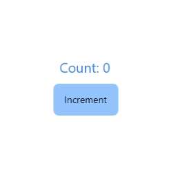

# JSignal

**[Website](https://wilgaboury.github.io/jsignal) • [Javadocs](https://wilgaboury.github.io/jsignal/javadoc/index.html) • [Discord](https://discord.gg/YN7tek3CM2)**

A declarative GUI library for Java desktop applications that takes strong inspiration
from [SolidJS](https://www.solidjs.com/).

## Module Disambiguation

| Module               | Description                                                                                                                                                                                   |
|----------------------|-----------------------------------------------------------------------------------------------------------------------------------------------------------------------------------------------|
| [JSignal](./jsignal) | reactive primitives                                                                                                                                                                           |
| [Sigui](./sigui)     | desktop GUI framework using JSignal, [Skia](https://skia.org/) ([Skija](https://github.com/HumbleUI/Skija/)), [JWM](https://github.com/HumbleUI/JWM), and [Yoga](https://www.yogalayout.dev/) |
| [Sigwig](./sigwig)   | standard component library                                                                                                                                                                    |

## Key Features

* Fine-grained reactivity: layout and painting is incremental and efficient
* Automatic dependency tracking: simply accessing state subscribes to it
* Hotswap: Code changes intelligently trigger parts of the component tree to be
  rerendered without stopping the application
* Skia graphics: powerful canvas API with support for software and hardware rendering
* Yoga layout: familiar, web-standard Flexbox layout

## Example

```java
@SiguiComponent
public class Counter implements Renderable {
  public static void main(String[] args) {
    SiguiThread.start(() -> {
      var window = SiguiUtil.createWindow();
      window.setTitle("Counter");
      window.setContentSize(250, 250);
      new SiguiWindow(window, Counter::new);
    }));
  }

  private final Signal<Integer> count = Signal.create(0);

  @Override
  public Nodes render() {
    return EzNode.builder()
      .layout(EzLayout.builder()
        .fill()
        .center()
        .column()
        .gap(10f)
        .build()
      )
      .children(
        Para.builder()
          .setString(() -> "Count: " + count.get())
          .setStyle(style -> style.setTextStyle(text -> text
            .setFontSize(20f)
            .setColor(EzColors.BLUE_500)
          ))
          .build(),
        Button.builder()
          .setColor(EzColors.BLUE_300)
          .setAction(() -> count.accept(c -> c + 1))
          .setChildren(() -> Para.fromString("Increment"))
          .build()
      )
      .build();
  }
}
```


